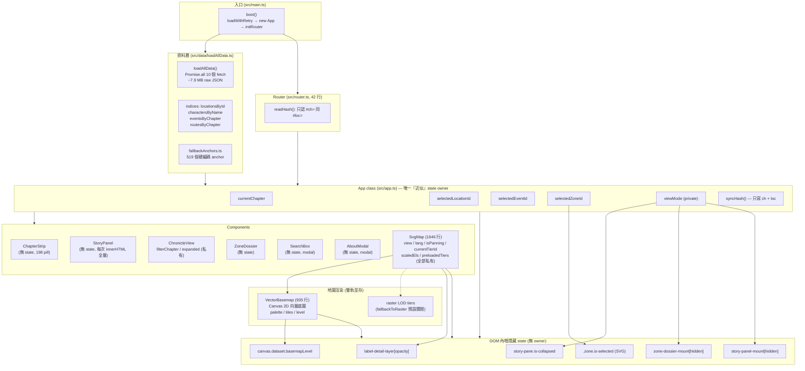

# Front-end Architecture Audit —— World Atlas V2（A3）

> 角色：**A3 Front-end Architect**（只讀審計子代理）
> 專案：`C:\Users\User\Desktop\benggong`｜Branch：`refactor/world-atlas-v2`
> Baseline commit：`0260ecb9272470b220fe2b98f54947858c05078b`
> 審計日期：2026-09-20
> 限制遵守：本報告**只讀** production code；只寫入 `docs/audits/frontend-architecture-audit.md` 同 `artifacts/audit-A3/`。冇任何 git 寫操作，冇讀取 `data/private/`。

---

## 任務摘要

呢次審計要回答 V2 重建最關鍵嘅架構問題：**現行 front-end 嘅 state / render / data 邊界能唔能夠支撐 spec §2.1、§5.1、§5.3 嘅要求？**

結論：**唔能夠，必須 breaking refactor。** 實測結果：

1. **URL contract 只有兩個參數**（`#ch=`、`#loc=`）。Spec §5.1 要求嘅 8 個參數（`#location=`、`?event=`、`?zone=`、`?character=`、`?chapter=`、`?spoiler=`、`?layers=`、`?view=`）**實測全部零支援**。zone selection、event selection **完全冇寫入 URL**，refresh 之後必然遺失。→ **P0**
2. **冇單一 state 來源**。`App` 持有 4 個 selection 欄位，但 `viewMode` 係 private、`ChronicleView` 有自己嘅 `filterChapter`/`expanded`、`SvgMap` 有自己嘅 `view`/`lang`/pan 狀態，而**大量 UI 狀態只存在於 DOM class／attribute**（`#story-pane.is-collapsed`、`#zone-dossier-mount[hidden]`、`.zone.is-selected`、`#label-detail-layer[opacity]`、`canvas.dataset.basemapLevel`）。→ **P0**
3. **`SvgMap.ts`（1646 行）同 `VectorBasemap.ts`（935 行）合共 2581 行做齊 layout、projection、LOD、render、interaction、data access 六件事**，完全違反 separation of concerns。→ **P0**
4. **Spec 核心 feature 缺失**：冇 layer toggle UI、冇 spoiler state／持久化、冇 `measure` context、冇 onboarding entry point。→ **P0**
5. **冇 data adapter / selector / index layer**。10 處直接 `features.find()/filter()` 線性掃描 raw GeoJSON；`SvgMap.render()` 內部仲有 O(events × locations) 雙重掃描。→ **P1**
6. **Config 邊界錯亂**：`map-config.json` 大部分欄位（`renderer`、`base_layers`、`initial_view`、`spoiler`、`scale_profile`、`provisional_mode`、`sources_*`）**前端零引用**；實際資產路徑、bbox、投影常數由 `SvgMap.ts` 直接 import 檔案 + 硬編碼。同一組常數（bbox、PROJ_COS）喺 3 個地方各自定義。→ **P1**
7. **CSS 高度綁死 TS 產生嘅 DOM 結構**：205 個 class selector 之中，43 個（~21%）搵唔到任何 TS 引用（疑死 CSS）；`hud.css` 有 **106 行完全重複** 嘅 `[data-theme="light"]` 區塊；全 CSS 有 13 個 `!important`、172 個硬編色值。→ **P1**
8. **雙軌 renderer 並存**：`SvgMap.ts`（Phase F SVG 標記層）＋ `src/map/VectorBasemap.ts`（Phase L Canvas 向量底圖）係**兩套 renderer 疊住行**，唔係替換關係；同時 28 MB raster LOD 圖磚係死重（`fallbackToRaster()` 預設關閉）。→ **P1**

**建議**：對全部 16 個 production module 作明確 keep / rewrite / delete 決定（見 §4），並按 spec §4.4 B1–B9 建立 ownership map（見 §7）。

---

## 假設與證據

### A. 審計範圍與方法

| 項目 | 內容 |
|---|---|
| 讀取檔案 | `src/**` 全部 17 個檔（7,916 行）＋ `data/public/map-config.json`、`public/assets/vector/manifest.json`、`public/assets/map-lod/manifest.json`、`public/assets/hk-basemap-coords.json` |
| 靜態分析 | `npx tsc --noEmit`、`npx eslint .`、`grep` 統計、Node 腳本抽取 schema／class 使用率 |
| 動態實測 | Playwright 1.62.1（headless Chromium，`args:["--no-proxy-server"]`），preview server `http://localhost:5180/` |
| 實測腳本 | `artifacts/audit-A3/router-url-audit.mjs`（17 個情境）、`artifacts/audit-A3/state-ownership-audit.mjs`、`artifacts/audit-A3/_probe.mjs` |
| 原始輸出 | `artifacts/audit-A3/router-url-audit.json`、`artifacts/audit-A3/state-ownership-audit.json` |

### B. 假設

1. **Spec 為唯一權威**：凡現行 code 同 `prompts/world-atlas-v2-rebuild.md` §2.1 / §4.3 / §4.4 / §4.5 / §5.1 / §5.3 / §6.3 衝突，一律以 spec 為準（spec §0.1 規則 5：「現有 code 唔係真相」）。
2. **`baseline-findings.md` 為主代理實測事實包**；本報告所有數字若同佢唔一致，以本報告自己實測為準並註明。實測後**未發現任何衝突**，唯一補充：baseline 指「48 個 zone polygon 完全冇 render」，本報告實測係 **chapter 過濾後只 render 1 個 zone**（見 §2.6），屬同一 root cause 嘅更精確描述。
3. **Spec §5.3 明言「不要求按此檔名硬拆，但要達成相同 separation of concerns」**，所以本報告嘅模組映射係「職責對應」而唔係硬性檔名要求。

### C. 現行架構圖（實測繪製）



**圖例解讀**：
- **實線** = 直接依賴；**虛線** = 條件依賴（只在 fallback 時觸發）。
- 注意 `App` 係「近似 state owner」而唔係真正 single source of truth：`viewMode` 係 private、component 各有私有 state、DOM 又儲住另一批 state。
- `Router` 只係 `App` 嘅單向 adapter，唔係 state 容器。

### D. 資料流（selection 生命週期實測）

```text
[使用者點 marker]
  → SvgMap.bindEvents click delegation (SvgMap.ts:625)
  → app.setSelectedLocation(id)            (app.ts:392)
      ├─ selectedLocationId = id
      ├─ selectedEventId = null ; selectedZoneId = null
      ├─ svgMap.render()      ← 全量重建 4 個 SVG layer
      ├─ setViewMode("chapter")  ← 隱式切換 viewMode
      ├─ storyPanel.updateForLocation(id)  ← 全量 innerHTML
      └─ syncHash()           ← 只寫 ch + loc ✅

[使用者點 zone]
  → SvgMap click delegation
  → app.setSelectedZone(zid)               (app.ts:356)
      ├─ selectedZoneId = zid ; 清空 loc / event
      ├─ svgMap.render()
      ├─ setViewMode("zone")
      ├─ zoneDossier.update(zid)
      └─ syncHash()           ← 只寫 ch（zone 被丟棄）❌ 實測 hash = "#ch=1"

[使用者點 event（StoryPanel 內）]
  → app.setSelectedEvent(eid)              (app.ts:420)
      ├─ selectedEventId = eid ; 清空 loc / zone
      ├─ svgMap.render()
      └─ storyPanel.updateForEvent(eid)
      ✗ 完全冇呼叫 syncHash()  ❌ 實測 hash 不變

[refresh / 分享連結]
  → router.readHash() 只讀 ch + loc
  → zone / event / layer / spoiler / viewMode 全部遺失
```

---

## 發現／改動

> 分級：**P0** = 阻斷 V2 spec，必須喺 Gate 1 前解決；**P1** = 嚴重架構缺陷，必須喺 B 階段處理；**P2** = 一致性／清理。

### 1. 現行架構測繪

#### 1.1 State 擁有權（實測）— **P0**

| State | 聲明位置 | 讀取方式 | 序列化 | 問題 |
|---|---|---|---|---|
| `currentChapter` | `App` (public) | `getCurrentChapter()` | `#ch=` ✅ | 唯一乾淨嘅 state |
| `selectedLocationId` | `App` (public) | **直接讀欄位**（`SvgMap.ts:1437`）＋ `getSelectedLocationId()` | `#loc=` ✅ | 兩種讀法並存 |
| `selectedEventId` | `App` (public) | **直接讀欄位**（`SvgMap.ts:1538`） | ❌ 冇 | 冇 `syncHash()` |
| `selectedZoneId` | `App` (public) | `getSelectedZoneId()` | ❌ 冇 | `syncHash()` 唔寫 zone |
| `viewMode` | `App` (**private**) | `getViewMode()` | ❌ 冇 | 冇 URL 表達 |
| `filterChapter` | `ChronicleView` (private) | `getChapterFilter()` | ❌ 冇 | 同 `currentChapter` 語意重疊 |
| `expanded` | `ChronicleView` (private) | — | ❌ 冇 | — |
| `view` (viewBox) | `SvgMap` (private) | `viewScale` getter | ❌ 冇 | refresh 重置 |
| `lang` (圖例語言) | `SvgMap` (private) | — | ❌ 冇 | 冇持久化 |
| panel 開合 | **DOM** `#story-pane.is-collapsed` | `classList.contains()` | ❌ 冇 | 冇 owner |
| dossier/panel 顯示 | **DOM** `[hidden]` | `.hidden` | ❌ 冇 | 由 `viewMode` 衍生，但唔同步 |
| zone 選中 | **DOM** `.zone.is-selected` | `querySelectorAll` | ❌ 冇 | 由 `selectedZoneId` 衍生 |
| label 透明度 | **DOM** `#label-detail-layer[opacity]` | — | ❌ 冇 | 由 `viewScale` 衍生 |
| basemap level | **DOM** `canvas.dataset.basemapLevel` | — | ❌ 冇 | 由 `view` 衍生 |
| theme | `theme.ts` + localStorage | `currentTheme()` | ❌ 冇（但有 localStorage） | 唯一有持久化嘅狀態 |

**實測證據**（`state-ownership-audit.json`）：mobile 390px 時 `paneCollapsedClass=true`（DOM-only，無 state 表示）；`localStorageKeys=[]`（theme 未手動切換時完全冇持久化）；`hasSpoilerControl=false`、`hasLayerToggle=false`。

**結論**：**冇單一 state 來源**。正確講法係「App 持有 4 個 selection 欄位 + 1 個 private viewMode，其餘狀態散落喺 6 個 component 私有欄位同 6 個 DOM class／attribute」。

#### 1.2 實際 render 觸發路徑 — **P1**

`SvgMap.render()`（`SvgMap.ts:1105–1557`）係一個 453 行嘅 method，每次 selection 改變都會：
1. `zonesLayer.replaceChildren()`、`routesLayer.replaceChildren()`、`locLayer.replaceChildren()`、`evLayer.replaceChildren()` — 清空全部 4 層；
2. 重建 48 個 zone `<g>`（每個含 glow path + area path + 可能 pulse path + badge + label + title）；
3. 重建 active routes（含 Catmull-Rom 平滑曲線計算）；
4. 重建 location markers（含 marker aggregation 分格）；
5. 重建 event markers。

即係：**點一個 marker = 重建全地圖 SVG**。呢個係 spec §5.3「以 requestAnimationFrame、transform、culling、LOD throttling 實現 smooth interaction」嘅直接反面。

---

### 2. Coupling 分析（SvgMap 1646 + VectorBasemap 935）

#### 2.1 `SvgMap.ts` 做嘅職責（實測分類）— **P0**

| 職責 | 行範圍 | 應該屬於 |
|---|---|---|
| 投影常數（PROJ_COS / BASEMAP_BBOX / BASE_VIEW） | 30–72 | `map-projection` |
| LOD tier 型別與幾何換算 | 74–104 | `map-lod` |
| Route 平滑曲線（Catmull-Rom→Bézier） | 106–141 | `RouteLayer` / `map-geometry` |
| 資產 URL 拼接 | 143–150 | `map-assets` |
| 縮放常數 / 動畫時長 | 152–199 | `map-lod` / `map-motion` |
| **硬編碼 37 個 FALLBACK_ANCHORS** | 201–244 | `data/` adapter（唔應該喺 renderer） |
| 座標解析四層邏輯 `resolveCoord` | 246–311 | `data/` selector |
| `lonlatToViewbox` 投影 | 313–323 | `map-projection` |
| Zone glyph path 表 | 325–341 | `ZoneLayer` |
| Legend 中英文字典 | 343–365 | `MapControls` / i18n |
| Shell HTML（canvas + svg + legend + controls） | 460–537 | `MapShell` |
| Vector basemap 生命週期 + raster fallback | 539–605 | `BaseGeometryLayer` |
| **全部 interaction**（click delegation / pan / wheel / pinch） | 607–773 | `map-interactions` |
| Camera 操作（scaledView / clampView / zoomBy / zoomToLocation） | 775–834 | `map-camera` |
| 像素↔user unit 換算 + applyViewBox | 836–861 | `MapViewport` |
| Geo bbox 計算 + LOD tier 揀選 + 預載 | 863–996 | `map-lod` |
| Label layer 透明度 | 998–1015 | `LabelLayer` |
| viewBox 動畫（rAF + ease-in-out cubic） | 1017–1064 | `map-camera` |
| 路線頂點座標解析 | 1066–1088 | `RouteLayer` |
| 圖例語言切換 | 1090–1103 | `MapControls` |
| **Zone 幾何→SVG 渲染** | 1157–1329 | `ZoneLayer` |
| **Route 渲染（含誠實性規則）** | 1332–1401 | `RouteLayer` |
| **Location marker 渲染 + aggregation** | 1403–1519 | `MarkerLayer` |
| **Event marker 渲染** | 1521–1556 | `EventLayer` |
| `flyToChapter`（bbox 計算 + camera 動畫） | 1559–1645 | `map-camera` + `map-lod` |

**違反 separation of concerns 嘅具體位置**：

1. **Renderer 直接讀 data**：`SvgMap.render()` 內直接 `this.data.routesByChapter.get(cur)`、`this.data.locations.features.filter(...)`、`this.data.zones.features`、`this.data.eventsByChapter.get(...)`（`SvgMap.ts:1112/1120/1200/1133`）——冇 selector／adapter 中間層。
2. **Renderer 直接讀 App state**：`this.app.getSelectedZoneId()`（1224）、`this.app.selectedLocationId`（1437，**直接讀 public 欄位**）、`this.app.selectedEventId`（1538）。三種 selection 用兩種唔同讀法。
3. **同時做 layout / render / interaction / LOD**：`bindEvents()` 直接操作 `this.view`、`clampView()`、`applyViewBox()`、`applyLiveScale()`、`render()`；`updateBasemapTier()` 又同時做 LOD 揀層 + DOM 寫入 + 事件派發 + 預載。
4. **投影邏輯內嵌**：`lonlatToViewbox` 同 `currentGeoBbox` 互為反函數但分開寫，冇共用 `map-projection` 單元。
5. **座標 fallback 決策內嵌 renderer**：`resolveCoord(name, lon, lat, {evidenceBacked})` 喺 renderer 內被呼叫 6 次；`hasEvidence()` 亦喺 renderer 定義。呢啲係 data 品質決策，唔應該由 renderer 決定。
6. **資產常數重複**：`assetUrl()` 喺 `SvgMap.ts:147` 同 `VectorBasemap.ts:249` **各自實作一次**（完全一樣）。

#### 2.2 `VectorBasemap.ts` 做嘅職責 — **P1**

| 職責 | 行範圍 | 問題 |
|---|---|---|
| 投影常數硬編碼 `PROJ_COS = 0.9247` | 32 | 同 `lodManifest.projection_cos` 重複，冇交叉驗證 |
| Palette（深／淺兩套共 78 行硬編色） | 142–246 | 唔跟 CSS token |
| Delta 解碼 + Path2D 建構 | 249–272, 397–464 | OK（單一職責） |
| 縮放層揀選 `pickLevel` | 480–484 | 同 `SvgMap.MAX_SCALE` 語意唔一致（一個用經度跨度、一個用倍率） |
| 圖磚 LRU + 預載 | 524–611 | OK |
| **全部繪製**（海／陸／綠地／水／建築／道路／標籤／暗角／格線） | 694–912 | 可以再分 `BaseGeometryLayer` / `LabelLayer` |
| Theme 監聽 | 914–923 | 正確（事件驅動，零依賴） |
| `destroy()` | 925–934 | 唯一有 teardown 嘅 class ✅ |

**正面發現**：`VectorBasemap` 嘅 **Canvas 路徑快取策略係正確嘅** —— 圖層內容改變時才重建 `Path2D`，平移／縮放只改 `setTransform` 矩陣（`VectorBasemap.ts:302–309, 722–729`）。呢個係 60fps 嘅關鍵，V2 必須保留。`ROAD_MIN_LEVEL` 同 Python script 刻意重複並有 test 比對（`tests/vector-basemap.test.ts`）—— 呢個 pattern 值得保留。

#### 2.3 雙軌 renderer 關係 — **P1**

```text
#svg-map-mount
├── <canvas id="basemap-canvas">    ← Phase L：VectorBasemap（向量底圖）
└── <svg id="svg-map">
    ├── <image id="basemap-group">  ← Phase F：raster PNG（預設 href 為空，只作 fallback）
    ├── <image id="label-detail-image"> ← raster 標籤（只作 fallback）
    ├── <g id="zones-layer">
    ├── <g id="routes-layer">
    ├── <g id="locations-layer">
    └── <g id="events-layer">
```

- **唔係替換關係，係雙軌並存**：`VectorBasemap` 只負責「底圖」（海陸／道路／建築／地名），`SvgMap` 仍然負責「標記層」（zone／route／marker／event）。兩者共用同一個 `view`（由 `syncBasemapView()` 每次 `applyViewBox()` 轉發，`SvgMap.ts:860`）。
- **`SvgMap` 係 orchestrator**：佢 new `VectorBasemap`、訂閱 `onReady`/`onError`、用 `ResizeObserver` 監察容器、並喺 `applyViewBox()` 內轉發 view。所以 `SvgMap` 同時係「shell」＋「viewport」＋「marker renderer」。
- **28 MB raster LOD 完全死重**：`updateBasemapTier()` 第一行 `if (!this.basemapFailed) return;`（`SvgMap.ts:959`）→ 向量底圖正常時 raster tier 永遠唔會啟用。baseline 實測 6 個 run 全部 0 次 `map-lod/` 請求。
- **但 raster 資產仍然入 bundle**：`import basemapPngUrl from "../../public/assets/hk-basemap.png?url"`（`SvgMap.ts:25`）＋ `lodManifest`（28）＋ `basemapCoords`（27）。baseline build 報告 `dist/assets/hk-basemap-*.png` 共 2.1 MB 入 bundle。

#### 2.4 模組映射表（現有 2581 行 → 新 `src/map/` 模組）

> 行號係現行檔案實際範圍。每個新模組列出「搬入嘅職責」同「要拆走嘅耦合」。

| 新模組 | 來源檔案：行範圍 | 搬入職責 | 必須移除嘅耦合 |
|---|---|---|---|
| `MapShell.ts` | `SvgMap.ts` 375–458（fields）、460–537（init shell） | 建立 `canvas + svg + overlay + controls` DOM 骨架；component 生命週期；`ResizeObserver` | 移除 `init()` 內直接 `bindEvents()` / `render()` 呼叫 → 改由 orchestrator 注入 |
| `MapViewport.ts` | `SvgMap.ts` 367–373、836–861、1017–1064 | `ViewBox` 型別；`applyViewBox()`；`pxToUserUnits()`；rAF 動畫 | 移除對 `updateBasemapTier()` / `updateLabelLayerOpacity()` 嘅直接呼叫 → 改 event 通知 |
| `map-projection.ts` | `SvgMap.ts` 30–72、313–323、863–882 | `PROJ_COS`、`BASEMAP_BBOX`、`BASE_VIEW`、`lonlatToViewbox()`、`currentGeoBbox()` | 從單一 manifest 讀 bbox／cos，刪除 `VectorBasemap.ts:32` 硬編碼 |
| `map-camera.ts` | `SvgMap.ts` 775–834、1559–1645 | `scaledView()`、`clampView()`、`zoomBy()`、`zoomToLocation()`、`flyToChapter()` 嘅目標計算 | 移除 `MIN/MAX_SCALE` 散落定義；`flyToChapter` 唔應該自己掃 `locations.features` |
| `map-lod.ts` | `SvgMap.ts` 74–104、152–199、884–996、998–1015 | `LodTier`、`tierSpan/tierRect`、`pickTier()`、`preloadFinerTier()`、`updateBasemapTier()`、label 透明度 | 移除「LOD 直接改 DOM」→ 只回傳決策，由 Layer 執行 |
| `map-interactions.ts` | `SvgMap.ts` 607–773 | click delegation、pan、wheel zoom、touch pinch | 移除直接 `this.app.setSelected*` → 改 dispatch typed intent event |
| `BaseGeometryLayer.ts` | `VectorBasemap.ts` 全文（935 行）＋ `SvgMap.ts` 539–605 | Canvas 向量底圖、tile LRU、palette、`fallbackToRaster()` | 移除硬編碼 `PROJ_COS`；palette 改由 token 注入 |
| `ZoneLayer.ts` | `SvgMap.ts` 325–341、1157–1329 | `ZONE_GLYPH`、zone polygon 渲染、zone label、selected 高亮 | 移除 `this.data.zones` 直接讀取 → 由 selector 傳入 |
| `RouteLayer.ts` | `SvgMap.ts` 106–141、1066–1088、1332–1401 | `smoothPath()`、`routeVertex()`、route 渲染、誠實性規則 | 移除 `resolveCoord` 內嵌呼叫 → 由 data adapter 預先解析 |
| `MarkerLayer.ts` | `SvgMap.ts` 1403–1519 | location marker + 畫面格 aggregation | 移除 `this.app.selectedLocationId` 直接讀取 |
| `EventLayer.ts` | `SvgMap.ts` 1521–1556 | event marker 渲染 | 移除 `this.app.selectedEventId` 直接讀取 |
| `LabelLayer.ts` | `SvgMap.ts` 998–1015、1306–1326＋`VectorBasemap.ts` 870–912 | zone label、POI label collision avoidance、label 淡入 | 統一 SVG 同 Canvas 兩套 label 邏輯 |
| `MapControls.ts` | `SvgMap.ts` 343–365、507–529、607–623、1090–1103 | legend HTML、中英字典、zoom/reset 按鈕、layer toggle（**新加**）、語言切換 | 移除 `toggleLegendLanguage()` 直接改 DOM → 由 state 驅動 |
| `src/data/`（adapter） | `SvgMap.ts` 201–311 | `FALLBACK_ANCHORS`、`FULL_HK_ANCHORS`、`hasEvidence()`、`resolveCoord()` | 完全移出 renderer；加 `zonesById` / `eventsById` / `routesById` index |

**映射覆蓋率**：SvgMap 1646 行之中，**1580 行（96%）** 有明確歸屬；剩 66 行係 header／imports／註解。VectorBasemap 935 行全部歸入 `BaseGeometryLayer`（內部可再分 `BasemapPalette` / `TileStore` / `BasemapDrawer` 三個檔）。

---

### 3. Router / URL contract（Playwright 實測）

#### 3.1 Spec §5.1 參數支援度 — **P0**

實測腳本：`artifacts/audit-A3/router-url-audit.mjs`｜原始輸出：`router-url-audit.json`

| Spec 要求 | 實測 URL | 實測結果 | 判定 |
|---|---|---|---|
| `#location=<id>` | `#location=loc_0545` | hash 保留但 **app 零反應**（stripNum=1、無 selection） | ❌ 唔支援 |
| `?event=<id>` | `?event=bg_event_001` | 完全無效（hash 空、stripNum=1） | ❌ 唔支援 |
| `?zone=<id>` | `?zone=zone_51bf7d8190` | 完全無效 | ❌ 唔支援 |
| `?character=<id>` | `?character=陳小明` | 完全無效 | ❌ 唔支援 |
| `?chapter=<n>` | `?chapter=150` | 完全無效（stripNum=1，**唔等於** `#ch=150`） | ❌ 唔支援 |
| `?spoiler=<0-3>` | `?spoiler=3` | 完全無效 | ❌ 唔支援 |
| `?layers=zones,events,routes` | `?layers=...` | 完全無效 | ❌ 唔支援 |
| `?view=map\|chronicle` | `?view=chronicle` | 完全無效 | ❌ 唔支援 |

**現行唯一支援**：`#ch=<1-198>` 同 `#ch=<n>&loc=<id>`。

| 情境 | 實測 | 結果 |
|---|---|---|
| `#ch=150` | stripNum=150、activePill=150 | ✅ |
| `#ch=150&loc=loc_0545` | stripNum=150、modeBtn=📖 章節 | ✅ |
| `#ch=150&loc=loc_0545` + refresh | hash 保留、storyTitle="康城海濱" | ✅（loc 有重現） |
| 點 marker | hash → `#ch=1&loc=loc_0002` | ✅（loc 有序列化） |
| **點 zone** | hash → `#ch=1`（zone 被丟棄） | ❌ zone 唔序列化 |
| **點 event** | hash **完全不變** | ❌ event 唔序列化（`setSelectedEvent` 冇 `syncHash()`） |
| refresh（zone/event 選中後） | 全部遺失，回到預設 chronicle | ❌ |

#### 3.2 無效 ID / 邊界 — 部分 graceful

| 情境 | 實測行為 | 判定 |
|---|---|---|
| `#ch=9999` | clamp 到 1，無 crash | ✅ graceful（但 URL 仍寫 9999，見 P2） |
| `#ch=abc` | 回 1，無 crash | ✅ |
| `#ch=0` | 回 1，無 crash | ✅ |
| `#ch=10&loc=loc_ZZZZ` | 無 crash，但 `setSelectedLocation` 被呼叫 → `viewMode` 被切去 chapter；`updateForLocation` 因 `locationsById.get()` 唔中而 early return（`StoryPanel.ts:211`）→ **面板內容同 viewMode 唔一致**，而且**無效 id 被寫返 URL** | ⚠️ 唔 crash 但狀態不一致 |
| `#ch=10&loc=` | hash 被 normalize 成 `#ch=10` | ✅ |

**頁面錯誤統計**：17 個情境全部 `pageErrors = []`、`console error = []`。即係**唔會 crash，但會靜默失敗**（silent no-op）—— 對用戶嚟講同 crash 一樣差（spec §5.1 要求「graceful fallback」＝要有可見 fallback 行為，唔係靜默）。

#### 3.3 其他 URL 相關缺陷

- **URL 唔 normalize**（P2）：`#ch=9999` 實際 state = 1，但 hash 保持 `#ch=9999` → 分享出去嘅連結同實際所見唔一致。
- **`viewMode` 冇 URL 表達**（P0）：`?view=map|chronicle` 唔支援，refresh 後永遠回 chronicle 預設，即使用戶身處 zone dossier。
- **`filterChapter` 同 `currentChapter` 語意重疊**（P1）：`#ch=150` 喺 chronicle mode 下係「filter」，喺 chapter mode 下係「顯示第 150 章」。同一個 URL 參數有兩種行為，但 URL 冇表達係邊種。

---

### 4. Data adapter 邊界 — **P1**

#### 4.1 載入量（實測）

`loadAllData()`（`loadAllData.ts:131–205`）用 `Promise.all` 一次過載入 **10 個檔、合共 ~7.9 MB raw JSON**：

| 檔案 | 大小 | 用途 |
|---|---|---|
| `events.geojson` | 1.74 MB | 1796 Point |
| `chronicle.json` | 1.46 MB | 1320 entries |
| `timeline.json` | 1.33 MB | 1796 entries |
| `locations.geojson` | 708 KB | 704 Point |
| `zones.geojson` | 311 KB | 48 Polygon |
| `routes.geojson` | 224 KB | 42 LineString |
| `chapter-summaries.json` | 217 KB | 198 章 |
| `characters.json` | 163 KB | 330 角色 |
| `chapter-appearances.json` | 69 KB | — |
| `map-config.json` | 1.9 KB | — |

**注意**：`timeline.json`（1.33 MB）**載入但完全冇被任何 component 讀取**（`grep timeline` 喺 src 內只搵到 CSS 同 type 定義）。即係 **1.33 MB 死資料**喺 critical path。

#### 4.2 Index layer 覆蓋不足 — **P1**

`AppData` 有 4 個 index：`locationsById`、`charactersByName`、`eventsByChapter`、`routesByChapter`。**缺**：`eventsById`、`routesById`、`zonesById`、`locationsByChapter`、`eventsByLocation`。

結果係 **10 行**共 11 次 `features.find()/filter()` 呼叫直接線性掃描 raw `features`，另加 1 次全量 `for...of` 迭代：

| 位置 | 掃描 | 複雜度 |
|---|---|---|
| `SvgMap.ts:656` | `routes.features.find()` | O(42) |
| `SvgMap.ts:818` | `locations.features.find()` | O(704) |
| `SvgMap.ts:1077` | `locations.features.find()`（**喺 route waypoint 迴圈內**） | O(routes × waypoints × 704) |
| `SvgMap.ts:1120` | `locations.features.filter()` | O(704) |
| `SvgMap.ts:1153` | `for (const l of locations.features)` 全量建 Map（**每次 render**） | O(704) |
| `SvgMap.ts:1527` | `locations.features.find()`（**喺 event 迴圈內**） | O(events × 704) |
| `StoryPanel.ts:173` | `routes.features.find()` | O(42) |
| `StoryPanel.ts:213` | `events.features.filter()` | O(1796) |
| `StoryPanel.ts:254` | `events.features.find()` | O(1796) |
| `ZoneDossier.ts:89` | `zones.features.find()` | O(48) |
| `AboutModal.ts:62` | `locations.features.filter()` ×2（`show()` 每次開 modal 都行） | O(704) ×2 |

**最嚴重**：`SvgMap.render()` 每次呼叫都重複 5 次全量掃描，而 `render()` 又被每次 selection 觸發。

#### 4.3 Component 直接讀 raw JSON shape — **P1**

- `StoryPanel` 直接讀 `this.data.chapterSummaries?.[ch]?.locations?.[0]?.name`（`StoryPanel.ts:38/129`）、`this.data.chapterAppearances.appearances`（39）—— 冇 adapter 隔離 raw shape。
- `ZoneDossier` 用 `p[sec.key]` 動態索引 `ZoneProperties`（`ZoneDossier.ts:100`）—— 對 schema 改動零保護。
- `ChronicleView` **自己重新聲明咗 `ChronicleEntry` / `ChronicleDoc` interface**（`ChronicleView.ts:24–54`），同 `loadAllData.ts:36–73` 嘅定義**完全重複**。兩個定義一旦分歧就會靜默錯配。
- `SvgMap` 直接讀 `zone.geometry.coordinates[0]`（`SvgMap.ts:1211`），並用 `as unknown as` 繞過型別（1211）。

**冇任何 selector / adapter layer**：component 直接讀 `AppData` 嘅 raw shape，冇 view-model 轉換、冇 normalization。

---

### 5. CSS 耦合（實測統計）

#### 5.1 規模與耦合 — **P1**

| 指標 | 實測值 |
|---|---|
| CSS 總行數 | 3,262（main 2047 + hud 785 + timeline 430） |
| 規則數（`{` 計） | 588（main 372 + hud 158 + timeline 58） |
| CSS class selector 總數 | **205** |
| class selector 喺 TS 完全搵唔到引用（疑死） | **43（~21%）** |
| `!important` | **13**（main 6 + hud 4 + timeline 3） |
| 硬編色值 `#hex` | **172** |
| CSS custom properties | main 530 個 `--` 宣告 / hud 185 / timeline 63 |
| `@media` | main 6 + hud 1 + timeline 0 |
| `prefers-reduced-motion` | 3 處（main 1107/2040、hud 564）✅ |
| `z-index` 使用 | 16 |

**綁死 component 內部 DOM 結構嘅程度**：全部 UI 都係由 TS 用 template string / `createElementNS` 生成，所以**每一個 class selector 都係綁死 TS 產生嘅 DOM 結構**。改 TS 嘅 HTML 結構就會令 CSS 靜默失效 —— 冇 CSS Modules / scoped style / BEM 契約。

#### 5.2 確認死 CSS — **P1**

以下 class **只喺 CSS 出現、全 `src/` TS 零引用**（實測：`grep -rl` 只中 `src/styles/`）：

```text
timeline.css（整個 Phase D timeline 功能已移除）：
  bg-provisional-banner, bg-measure-btn, bg-measure-tip, bg-search,
  bg-search-results, bg-search-sub, bg-sidebar-inner, bg-about-inner,
  bg-char-list, bg-detail-actions, bg-dot, bg-hint, bg-marker, bg-meta,
  char-dot, tl-item, tl-list, tl-spoiler, tl-filter, tl-chapter,
  tl-date, tl-desc, tl-highlight, tl-marker, tl-meta
main.css：
  is-current
```

`timeline.css`（430 行）**大部分係死 CSS**，對應一個已移除嘅 timeline 功能。`bg-measure-*` 對應 spec §5.1 要求嘅 `measure` context —— 曾經做過、後來移除、CSS 留低。

#### 5.3 重複與衝突 — **P1**

- **`hud.css` 有兩段完全重複嘅 `[data-theme="light"]` 區塊**：`hud.css:584–690` 同 `hud.css:690–785`（約 106 行），內容 identical（兩個區塊開頭都係同一段註解 + 同一組 `--hud-*` 變數）。`grep -c` 顯示 `[data-theme="light"]` 喺 hud.css 出現 **52 次**。
- **`main.ts:5–6` 重複 import `./styles/hud.css` 兩次**（P2）。
- **深色為預設、淺色為覆蓋**：`main.css:22` `:root` 定義深色 token，但實測 `document.documentElement[data-theme] = "light"`（因為 headless Chromium 預設 `prefers-color-scheme: light`）→ 即係**所有 baseline 截圖都係淺色**，同 spec §1.1「深色、末日情報指揮室」方向相反。呢個係 `theme.ts:31–35` 跟系統偏好嘅副作用。

---

### 6. Legacy 分析

#### 6.1 雙軌 renderer — **P1**

見 §2.3。補充實測：

| 資產 | 大小 | Runtime 狀態 |
|---|---|---|
| `public/assets/vector/` | 12 MB | ✅ 每次載入（manifest + land + water + areas + labels + roads-l0） |
| `public/assets/map-lod/` | **28 MB** | ❌ 零 runtime 請求（6 個 baseline run 全部 0 次） |
| `public/assets/hk-basemap.png` | 1.9 MB | ⚠️ 入 bundle，但只作 fallback（預設 `href` 為空） |
| `public/assets/hk-basemap-labels.png` | 132 KB | ⚠️ 同上 |
| `public/assets/map-tiles/`、`markers/`、`ui/`、`generated/` | 0 | 空目錄 |

**Phase F（`SvgMap.ts`）同 Phase L（`VectorBasemap.ts`）嘅關係**：唔係 legacy vs replacement，而係 **`SvgMap` 做 shell + viewport + 標記層，`VectorBasemap` 做底圖**。但 `SvgMap` 同時保留咗 raster fallback 路徑（`fallbackToRaster()`）＋ 完整 raster LOD 揀層邏輯（`pickTier` / `preloadFinerTier` / `updateBasemapTier` / `tierRect`），而呢條路徑**正常情況永遠唔會行**。即係：

- **死 code**：`pickTier()`、`tierRect()`、`preloadFinerTier()`、`updateBasemapTier()`（正常路徑下永遠 early return）、`preloadFinerTier()` 內嘅 `preloadedTiers`、`currentTierId`、`lodManifest.tiers` 全部資料。
- **死資產**：28 MB `map-lod/`。
- **死 import**：`SvgMap.ts:25–28` 4 個 asset import 之中，3 個（PNG ×2、lodManifest）只服務死路徑。

#### 6.2 Stale config 統計 — **P1**

`data/public/map-config.json` 欄位前端引用實測：

| 欄位 | 前端引用 | 判定 |
|---|---|---|
| `map.renderer: "svg"` | **0** | ❌ stale（實際係 canvas vector + svg overlay） |
| `map.basemap_png` / `basemap_labels_png` / `basemap_coords` | **0** | ❌ stale（`SvgMap.ts` 直接 import 檔案） |
| `map.lod_manifest` | **0** | ❌ stale（同上） |
| `map.svg_basemap` | **0** | ❌ legacy（type 註解已自認「從來冇存在過」） |
| `map.tiles_local_only` | **0** | ❌ 未用 |
| `map.default_base_layer` / `base_layers` | **0** | ❌ 未用（`ai-aerial-concept`、`debug-grid` 從未實作） |
| `map.initial_view` | **0** | ❌ 未用（實際 view 由 `BASE_VIEW` 硬編碼） |
| `map.coordinate_system` / `projection` / `standard_parallel` | **0** | ❌ 未用（投影由 lodManifest + 硬編碼決定） |
| `map.show_scale_bar` | **0** | ❌ 未用（冇 scale bar UI） |
| `scale_profile` | **0** | ❌ 未用 |
| `spoiler.default_max_level` | **0** | ❌ **未用** —— spec §0.3 要求「default 劇透模式安全，可持久化」，完全冇實作 |
| `provisional_mode` | **0** | ❌ 未用，且 banner 文案違反零人手規則（見 6.3） |
| `sources_enabled` / `sources_reserved` | **0** | ❌ 未用 |
| `chapters.total` | ✅ 7 處 | 唯一真正使用嘅欄位 |

**即係：`map-config.json` 12 個頂層區塊之中，只有 `chapters` 有被前端使用。** 其餘全部係 stale metadata。

#### 6.3 違反零人手規則嘅文案 — **P1**

`map-config.json:40`：

> `"banner": "⚠️ 部份資料（角色路線）仍待人工審閱。已發佈內容經自動驗證，但角色路線來源自私有審閱文件，未經最終人工確認。請勿引用作準確資料。"`

呢段文案明言「仍待人工審閱」「未經最終人工確認」—— 直接違反 spec §0.1 規則 1（零人手參與）同 AGENTS.md「🚫 零人手參與（強制）」。雖然前端目前唔讀呢個欄位，但佢係 public dataset 一部分，會被 deploy。

---

### 7. Keep / Rewrite / Delete 建議（逐個 module，不可模糊）

| # | Module | 行數 | 決定 | 原因 |
|---|---|---|---|---|
| 1 | `src/main.ts` | 95 | **REWRITE** | 邏輯（retry / error panel / SW 註冊）值得保留，但要：刪除重複 `hud.css` import（5–6）；`showError` 改用新 error UI；`boot()` 改為建立 state store + adapter 再 mount。 |
| 2 | `src/app.ts` | 441 | **DELETE → 重建為 `src/state/`** | 而家係「App class 做齊 shell HTML + state + component orchestration + 快捷鍵 + 匯出 + 分享」。V2 要拆成 `state/store.ts`（single source of truth）、`state/url.ts`（URL contract）、`AppShell.ts`（layout only）。**唔可以 incremental patch** —— 因為 state ownership 同 URL serialization 都要由零重寫。 |
| 3 | `src/router.ts` | 42 | **DELETE** | 只認 `ch`/`loc`，同 spec §5.1 八個參數完全唔兼容。由 `state/url.ts` 取代（hash + query 雙向 serialize／hydrate，含無效 ID graceful fallback 同 URL normalization）。 |
| 4 | `src/theme.ts` | 89 | **REWRITE** | 核心機制（`data-theme` on `<html>`、localStorage、`basemap-theme-change` 事件、跟系統偏好）**係正確嘅，值得保留**。但要：跟 spec §1.1 改為**預設深色**（唔跟 `prefers-color-scheme` 決定預設）、token 化、加 reduced-motion 對接。 |
| 5 | `src/exportMap.ts` | 148 | **KEEP** | 職責單一（SVG+canvas → PNG）、註解清楚、已處理 `underlay` canvas。**唯一**要改係當 renderer 拆分後更新 selector（`#svg-map` / `#basemap-canvas`）。屬 B5／B9 範圍。 |
| 6 | `src/data/loadAllData.ts` | 205 | **REWRITE** | 保留 typed fetch + content-type 檢查 + index 建構概念。但要：加 `eventsById` / `routesById` / `zonesById` / `locationsByChapter` / `eventsByLocation` index；移除 `timeline.json`（1.33 MB 死載入）；拆成 `adapter/`（normalize）+ `selectors/`（查詢）+ `indexes/`。 |
| 7 | `src/data/fallbackAnchors.ts` | 519 | **REWRITE（搬去 data pipeline）** | 519 個硬編碼 anchor 係 data 品質問題，唔應該喺 front-end bundle。應搬去 `scripts/` 產生 → 輸出成 public dataset（如 `location-anchors.json`），front-end 只讀結果。屬 B3／B4 交界。 |
| 8 | `src/types/dataset.ts` | 361 | **REWRITE** | 型別基礎好（`LocationPrecision`、`ReviewStatus`、`SpoilerLevel` 齊全），但：`ZoneProperties` 冇 `zone_type`/`status`/`danger_level`/`spatial_precision`/`display_style`/`event_ids`/`character_ids`/`dossier_id`/`review_status`（spec §2.4 要求）；`MapConfig` 有大量 stale 欄位（見 §6.2）。要加 `PrimaryContext` discriminated union（spec §5.1）。 |
| 9 | `src/components/SvgMap.ts` | 1646 | **DELETE（全拆）** | 6 個職責混一，見 §2.1。拆成 §2.4 表所列 12 個 `src/map/` 模組。**唔可以保留任何一部分做 monolith。** |
| 10 | `src/map/VectorBasemap.ts` | 935 | **REWRITE（保留演算法）** | Canvas `Path2D` 快取 + `setTransform` 策略**係正確嘅，必須保留**。但要：刪硬編碼 `PROJ_COS`；palette 改由 token 注入；拆 `BasemapPalette` / `TileStore` / `BasemapDrawer`；對接新 `map-projection`。 |
| 11 | `src/components/ChronicleView.ts` | 433 | **REWRITE** | 概念（`story_time` vs `first_mention_chapter`、伏筆／回解答、時期分組、章節 filter）**係好嘅，保留**。但要：加 virtualization／pagination（spec §2.1 明言「唔可以一開始 render 大量 card」——而家 1320 條全量 `innerHTML`）；刪重複 interface 定義（改用 `loadAllData` 嘅型別）；加 `?view=chronicle` + filter URL 序列化。 |
| 12 | `src/components/StoryPanel.ts` | 286 | **REWRITE** | 內容結構（chapter summary / events / characters / routes）可保留，但：`innerHTML` 全量重建 + 10 處 raw scan 要改；`char-chip` click 有 `// TODO: open character modal` 死路（`StoryPanel.ts:165–167`）；`console.log("char click:", name)` 係 debug 殘留（167）。要支援 spec §5.1 全部 context kind。 |
| 13 | `src/components/ZoneDossier.ts` | 192 | **REWRITE** | 分節卡片設計（`SECTIONS` 表驅動）**係好嘅，保留**。但要：改用新 `zone-dossiers.json` schema（spec §2.4）；加 `infected_nest` 專用欄位（威脅特徵／活動模式／影響範圍）；加「資料未足以確認」狀態（spec §2.4 明言唔可以顯示空洞假資料）；`p[sec.key]` 動態索引要改型別安全。 |
| 14 | `src/components/SearchBox.ts` | 165 | **REWRITE** | 基本搜尋可用，但：只搜 character/event/location（spec §3 Journey D 要求加 zone/chapter）；O(330 + 1796 + 704) 每次 keystroke 線性掃描（spec §7.4 要求 ≤150ms）；冇 keyboard up/down/Enter 導航（spec §7.2 測試 4 要求）；jumpTo 唔寫 URL。要改為 local index（B3 提供）+ 分類結果 + 完整 keyboard。 |
| 15 | `src/components/ChapterStrip.ts` | 88 | **REWRITE** | 198 個 pill 一次 render 係可接受（198 個 DOM 節點）。但要：加 virtualization 或 windowing；click 行為要跟 `viewMode` 唔同（而家靠 `App.setChapter` 內部分支，語意隱晦）；`scrollIntoView({behavior:"smooth"})` 唔理 `prefers-reduced-motion`。 |
| 16 | `src/components/AboutModal.ts` | 93 | **REWRITE** | 內容（統計、版權、快捷鍵）可保留。但文案 stale：`AboutModal.ts:71` 寫「將軍澳為主嘅 SVG 簡化地圖（手繪 outline）」—— 實際已經係全港 Canvas 向量底圖；`198 章` 硬編碼（66）而唔讀 `config.chapters.total`。modal 冇 focus trap、冇 `aria-modal`、冇 Esc 內部處理（靠 `App.bindKeys`）。 |
| — | `src/styles/main.css` | 2047 | **REWRITE** | 深色 token 基礎可留，但要全面 token 化（spec §5.2 要求 color/spacing/radius/shadow/z-index/motion 七組 token）、刪死 CSS、清 `!important`。屬 B1。 |
| — | `src/styles/hud.css` | 785 | **REWRITE** | 刪 106 行重複 light block；合併去 token 系統。屬 B1。 |
| — | `src/styles/timeline.css` | 430 | **DELETE** | 大部分係已移除功能嘅死 CSS（`tl-*`、`bg-search*`、`bg-sidebar-*`、`bg-measure-*`、`bg-provisional-banner`）。只有極少數共用樣式（如 `.bg-spoiler-btns`）需先確認再搬。屬 B1。 |
| — | `public/assets/map-lod/`（28 MB） | — | **DELETE（待 A4/C3 確認）** | 零 runtime 請求；向量底圖已取代。但 spec §2.3 允許「high-resolution atmospheric raster 僅作 texture」—— 若要保留 texture，必須改為真 pyramid tiles 並實際接駁。屬 B5／B4。 |
| — | `public/assets/hk-basemap.png` / `-labels.png`（2.1 MB） | — | **DELETE（待 A4/C3 確認）** | 只作 fallback；若 V2 保留 fallback 就 KEEP，否則 DELETE。屬 B5。 |

**總結**：16 個 production module 之中 —— **KEEP 1 個**（`exportMap.ts`）、**REWRITE 11 個**、**DELETE 4 個**（`app.ts`、`router.ts`、`SvgMap.ts`、`timeline.css`）。**冇任何 module 可以原樣保留做 V2 主幹。**

---

### 8. Ownership map 草案（spec §4.4 B1–B9）

**硬性原則**：同一時間只可以有**一個** agent 改同一個 production file。跨 scope 需要嘅共享 interface 必須由主代理先 freeze，再派發。

#### 8.1 新檔案結構建議

```text
src/
  main.ts                          # B2
  AppShell.ts                      # B2（取代 app.ts 嘅 layout 部分）
  state/
    store.ts                       # B2 —— single source of truth（含 PrimaryContext）
    url.ts                         # B2 —— URL contract（serialize / hydrate / normalize）
    actions.ts                     # B2 —— typed intents
  types/
    dataset.ts                     # B3（B2 可加 PrimaryContext，需協調）
    context.ts                     # B2
  data/
    loadAllData.ts                 # B3
    adapter/
      locations.ts                 # B3 —— normalize + coord resolve（由 SvgMap 搬入）
      zones.ts                     # B3
      events.ts                    # B3
      chronicle.ts                 # B3
      characters.ts                # B3
    selectors/
      byId.ts                      # B3 —— eventsById / routesById / zonesById
      byChapter.ts                 # B3
      byZone.ts                    # B3
      search.ts                    # B3 —— 分類 search index
  map/
    MapShell.ts                    # B5
    MapViewport.ts                 # B5
    map-projection.ts              # B5
    map-camera.ts                  # B5
    map-lod.ts                     # B5
    map-interactions.ts            # B6
    BaseGeometryLayer.ts           # B5
    BasemapPalette.ts              # B5
    TileStore.ts                   # B5
    ZoneLayer.ts                   # B6
    RouteLayer.ts                  # B6
    MarkerLayer.ts                 # B6
    EventLayer.ts                  # B6
    LabelLayer.ts                  # B6
    MapControls.ts                 # B6
  components/
    ChronicleView.ts               # B7
    ChapterStrip.ts                # B7
    StoryPanel.ts                  # B2（context detail panel）
    ZoneDossier.ts                 # B6（zone context）
    SearchBox.ts                   # B3（用 search index）
    AboutModal.ts                  # B8（a11y：focus trap）
    ContextPanel.ts                # B2（統一 context 顯示）
  theme.ts                         # B1
  styles/
    tokens.css                     # B1
    main.css                       # B1
    hud.css                        # B1
    motion.css                     # B1
  exportMap.ts                     # B9（只更新 selector）
```

#### 8.2 File ownership（單一寫入者）

| B | 子代理 | 可寫範圍（獨佔） | 唯讀但相關 | 依賴 |
|---|---|---|---|---|
| B1 | Design System & Motion | `src/theme.ts`、`src/styles/**`、`public/assets/ui/**` | 所有 component 嘅 class 名 | 無（最先） |
| B2 | App State & Router | `src/main.ts`、`src/AppShell.ts`、`src/state/**`、`src/types/context.ts`、`src/components/StoryPanel.ts`、`src/components/ContextPanel.ts` | `src/types/dataset.ts`（由 B3 擁有） | B1 tokens 未必需；**必須先 freeze state contract** |
| B3 | Data Adapter | `src/data/**`、`src/types/dataset.ts`、`src/components/SearchBox.ts` | `src/state/**`（B2） | 需 B2 先 freeze `PrimaryContext` type |
| B4 | Territory Data Pipeline | `scripts/**`、`data/schemas/**`、`data/public/zones.geojson`、`data/public/zone-dossiers.json` | `src/types/dataset.ts` | 需 B3 freeze schema |
| B5 | Vector Map & LOD Renderer | `src/map/MapShell.ts`、`MapViewport.ts`、`map-projection.ts`、`map-camera.ts`、`map-lod.ts`、`BaseGeometryLayer.ts`、`BasemapPalette.ts`、`TileStore.ts`、`public/assets/vector/**` | `src/map/map-interactions.ts`（B6） | 需 B3 selectors + B2 store |
| B6 | Map Interaction | `src/map/map-interactions.ts`、`ZoneLayer.ts`、`RouteLayer.ts`、`MarkerLayer.ts`、`EventLayer.ts`、`LabelLayer.ts`、`MapControls.ts`、`src/components/ZoneDossier.ts` | `src/map/MapShell.ts`（B5） | 需 B5 layer 介面 freeze |
| B7 | Chronicle Experience | `src/components/ChronicleView.ts`、`src/components/ChapterStrip.ts`、`src/styles/chronicle.css`（新增） | `src/data/adapter/chronicle.ts`（B3） | 需 B2 URL contract + B3 adapter |
| B8 | Mobile + A11y | `src/components/AboutModal.ts`、`src/styles/mobile.css`（新增）、`src/a11y/**` | 所有 component 嘅 aria 屬性 | 需 B1 shell + B2 store |
| B9 | Visual QA Automation | `tests/**`、`artifacts/**`、`scripts/qa/**` | 全部 | 最後 |

#### 8.3 共享檔案衝突規則

| 共享檔案 | 擁有者 | 其他人點做 |
|---|---|---|
| `src/types/dataset.ts` | **B3** | B2 要加 `PrimaryContext` → 開新檔 `src/types/context.ts`，唔改 `dataset.ts`。B4 要改 schema → 先交 interface contract 畀主代理，由 B3 統一改。 |
| `src/styles/tokens.css` | **B1** | 其他人只可以 `var(--token)` 消費，**嚴禁**加新 token。要新 token → 向主代理申請，由 B1 加。 |
| `src/map/MapShell.ts` | **B5** | B6 只可以透過 `MapShell` 暴露嘅 `registerLayer(layer)` API 掛載，唔可以改 shell 內部。 |
| `src/state/store.ts` | **B2** | 其他人只可以 `subscribe()` / `dispatch()`，唔可以直接改 store 內部結構。 |
| `data/public/map-config.json` | **B4**（經 B3 review） | 前端唔可以再直接 import asset；config 由 B4 產生、B3 消費。 |
| `src/main.ts` | **B2** | 其他 agent 唔改。 |

#### 8.4 整合順序（依 spec §4.5，加實測依賴）

```text
1. B1 tokens（無依賴，可最早開）
2. B2 state/router  ← 必須先 freeze PrimaryContext + URL contract
3. B3 data adapters ← 依賴 B2 嘅 context type
4. B4 data pipeline outputs ← 依賴 B3 schema
5. B5 renderer/LOD ← 依賴 B3 selectors
6. B6 map interaction ← 依賴 B5 layer API
7. B7 chronicle ← 依賴 B2 URL + B3 adapter
8. B8 mobile/a11y ← 依賴 B1 shell + B2 store
9. B9 QA harness
10. 刪 legacy：SvgMap.ts、app.ts、router.ts、timeline.css、map-lod/、死 import、死 state、重複監聽器
```

---

## 修改檔案

**冇。** 本任務係只讀審計，`src/**`、`data/**`、`public/**`、`tests/**`、`package.json`、`vite.config.ts`、`tsconfig.json`、`scripts/**`、`.gitignore` 全部零改動，亦無任何 git 寫操作。

新增檔案（只喺允許範圍）：

| 路徑 | 用途 |
|---|---|
| `docs/audits/frontend-architecture-audit.md` | 本報告 |
| `artifacts/audit-A3/router-url-audit.mjs` | Router / URL contract 實測腳本（17 情境） |
| `artifacts/audit-A3/router-url-audit.json` | 上述腳本原始輸出 |
| `artifacts/audit-A3/state-ownership-audit.mjs` | State ownership / DOM 散落 state 實測腳本 |
| `artifacts/audit-A3/state-ownership-audit.json` | 上述腳本原始輸出 |
| `artifacts/audit-A3/_probe.mjs` | marker/zone click → URL 直接驗證腳本 |
| `artifacts/audit-A3/router-*.png` | 實測截圖（如有產生） |

---

## 沒有修改但相關的檔案

以下檔案被讀取／分析但未修改，係 V2 重建嘅關鍵輸入：

| 檔案 | 為何相關 |
|---|---|
| `src/components/SvgMap.ts` | 待拆（§2.4 模組映射表） |
| `src/map/VectorBasemap.ts` | 待 rewrite（保留 Path2D 快取策略） |
| `src/app.ts` | 待拆成 `state/` + `AppShell.ts` |
| `src/router.ts` | 待刪，由 `state/url.ts` 取代 |
| `src/main.ts` | 待 rewrite（重複 import、boot 流程） |
| `src/data/loadAllData.ts` | 待加 index + 刪 timeline 死載入 |
| `src/data/fallbackAnchors.ts` | 519 anchor 待搬去 data pipeline |
| `src/types/dataset.ts` | zone schema 缺 spec §2.4 欄位 |
| `src/styles/main.css` / `hud.css` / `timeline.css` | 待 token 化 / 刪死 CSS / 刪重複 |
| `data/public/map-config.json` | 12 區塊只有 1 個被用；banner 違反零人手規則 |
| `public/assets/map-lod/manifest.json` | 28 MB 死資產嘅 manifest |
| `public/assets/vector/manifest.json` | 向量底圖 manifest（bbox／PROJ_COS 來源之一） |
| `public/assets/hk-basemap-coords.json` | bbox 第二來源 |
| `artifacts/audit-context/baseline-findings.md` | 主代理事實包（本報告引用並補充） |
| `prompts/world-atlas-v2-rebuild.md` | Spec 權威 |

---

## 驗證命令與結果

| 命令 | 結果 |
|---|---|
| `npx tsc --noEmit` | **PASS**（exit 0，零輸出） |
| `npx eslint .` | **6 errors / 1 warning** —— 全部喺 `artifacts/audit-A4/`、`artifacts/audit-A8/`、`artifacts/audit-A9/` 嘅審計腳本（unused vars）；**`src/**` 零 lint error**；`artifacts/audit-A3/**` 零 error |
| `curl --noproxy '*' http://localhost:5180/` | **HTTP 200**（preview server 正常） |
| `curl --noproxy '*' http://127.0.0.1:5180/` | HTTP 000（確認必須用 `localhost`，同 baseline 一致） |
| `node artifacts/audit-A3/router-url-audit.mjs` | 完成，17 個情境，**0 pageError、0 console error** |
| `node artifacts/audit-A3/state-ownership-audit.mjs` | 完成，`pageErrors: []` |
| `node artifacts/audit-A3/_probe.mjs` | marker click → `#ch=1&loc=loc_0002` ✅；zone click → `#ch=1`（zone 被丟棄）❌ |
| `grep -c "!important" src/styles/*.css` | hud 4 / main 6 / timeline 3 = **13** |
| `grep -c "addEventListener" src/` | **50** 次註冊 vs **1** 次 `removeEventListener` |
| `grep -rn "\.features\.find(\|\.features\.filter(" src/` | **10** 處線性掃描 raw features |

---

## Screenshots / Artifacts

```text
artifacts/audit-A3/
  router-url-audit.mjs               # 17 情境 router/URL 實測腳本
  router-url-audit.json              # 原始輸出（每個情境嘅 hash/stripNum/modeBtn/console）
  state-ownership-audit.mjs          # state ownership + DOM 散落 state 實測
  state-ownership-audit.json         # 原始輸出（含 mobile 390 嘅 is-collapsed DOM-only 證據）
  _probe.mjs                         # marker/zone click → URL 直接驗證
```

關鍵證據引用位置：

- **URL 參數支援度** → `router-url-audit.json` → `results[0..7]`（`spec-*`）
- **zone/event 唔序列化** → `router-url-audit.json` → `results[12..13]`（`click-*-then-url`）＋ `_probe.mjs` 輸出
- **無效 ID graceful** → `router-url-audit.json` → `results[9..12]`（`invalid-*`）
- **DOM-only state** → `state-ownership-audit.json` → `steps[mobile 390 initial]`
- **無 spoiler / 無 layer toggle** → `state-ownership-audit.json` → `hasSpoilerControl:false`、`hasLayerToggle:false`
- **baseline 截圖** → `artifacts/screenshots/baseline-*.png`（由主代理產生，本報告引用）
- **最大 zoom 截圖** → `artifacts/screenshots/baseline-zoom-*.png`

---

## 風險、衝突、限制

### 風險

| ID | 風險 | 等級 | 緩解 |
|---|---|---|---|
| R1 | **URL contract 重寫會令現有 `#ch=` 分享連結失效** | 中 | `state/url.ts` 保留 `#ch=` 作為 legacy alias（讀取時映射去 `?chapter=`），並在 spec 記錄 deprecation |
| R2 | **拆 `SvgMap.ts` 期間會有一段「兩套 renderer 都唔完整」嘅窗口** | 高 | B5 必須先 freeze `MapShell` + `MapViewport` API，B6 逐個 layer 遷移（Zone → Route → Marker → Event），每個 layer 完成後跑一次 zoom quality test |
| R3 | **刪 28 MB `map-lod/` 需要 A4/C3 確認冇 texture 用途** | 低 | 本報告建議 DELETE；但若 spec §2.3 要保留 atmospheric texture，則需 B4 重新產生真 pyramid |
| R4 | **`VectorBasemap` 硬編碼 `PROJ_COS = 0.9247` 同 `lodManifest.projection_cos` 目前一致但無強制** | 中 | `map-projection.ts` 改為單一來源 + 加 unit test 比對 Python script（沿用 `tests/vector-basemap.test.ts` 現有 pattern） |
| R5 | **`ChronicleView` 1320 條全量 render，virtualization 會改變 scroll 行為** | 中 | B7 保留 `scrollIntoView` 語意（伏筆跳轉要用），用 windowed list + `scrollToIndex` |
| R6 | **CSS 全面 token 化會令 172 個硬編色值需要逐一映射** | 中 | B1 先建 token 對照表，再逐檔替換；用 visual regression（B9）驗證無走樣 |
| R7 | **`resolveCoord` 由 renderer 搬去 data adapter，可能改變座標解析結果** | 高 | 搬遷時加 golden test：對 704 個 location 跑新舊兩條路徑，assert 座標一致 |

### 衝突

| ID | 衝突 | 裁決 |
|---|---|---|
| C1 | `main.css` `:root` 係深色，但實測 headless 環境 `data-theme="light"` | 唔係衝突，係 `theme.ts` 跟系統偏好。**V2 spec §1.1 要求預設深色** → B1 改為預設深色，唔跟 `prefers-color-scheme` |
| C2 | `zones.geojson` 用 `kind`（`survivor`/`nest`/`outpost`），spec §2.4 要求 `zone_type`（6 值） | **Spec 為權威** → B4 加 versioned migration；B3 型別加 alias 過渡 |
| C3 | `map-config.json` 話 `renderer: "svg"`，實際係 canvas | **Spec §2.3 要求 vector first** → config 由 B4 重寫 |
| C4 | `AboutModal` 文案話「將軍澳為主嘅 SVG 簡化地圖」，實際已係全港 canvas | 文案 stale → B8 更新 |

### 限制

1. **App 冇暴露到 `window`**，所以 E2E 只能由 DOM 反推 state（`#strip-ch-num`、`.ch-pill.active`、`#btn-mode` 文字）。建議 B2 喺 dev build 加 `window.__atlas = store`（**只限 dev**），令 C1–C8 可以精確驗證 state。
2. **本報告冇做 visual regression**（屬 A2/C2 範圍）。
3. **本報告冇做性能 profile**（屬 A8/C6 範圍）。已觀察到嘅性能問題（每次 selection 全量重建 SVG、O(events × locations) 掃描）留待 A8 量化。
4. **zone 可見性過濾**（`SvgMap.ts:1204`：`c <= cur && cur <= c + 12`）令第 1 章只 render 1 個 zone。呢個係 zone layer 設計問題，屬 A5/A4 範圍，本報告只作交叉引用。
5. **`data/private/` 完全冇讀取**（依硬性限制）。
6. 本報告建議全部基於**靜態閱讀 + Playwright 實測**，冇修改 production code 驗證，所以拆模組嘅工作量估算唔包含 hidden coupling 嘅意外。

---

## 給主代理的 integration note

**1. Gate 1 必須作嘅 breaking 決定（唔可以 incremental）**

- **State**：廢除 `App` class 嘅 4 個 selection 欄位 + private `viewMode`，改為 `src/state/store.ts` 單一 store（含 spec §5.1 `PrimaryContext` discriminated union）。DOM class／attribute 只可以做**衍生輸出**，唔可以再儲 state。
- **URL**：`router.ts` 刪除，`state/url.ts` 一次過實作 spec §5.1 全部 8 個參數 + `#ch=` legacy alias + 無效 ID graceful fallback + URL normalization。**呢個係 B2 嘅第一優先，因為所有其他 module 都依賴佢。**
- **Renderer**：`SvgMap.ts` 完全拆散（§2.4 表），`VectorBasemap.ts` rewrite 但**保留 Canvas Path2D 快取 + setTransform 策略**。
- **Data**：`loadAllData.ts` 加齊 index；`resolveCoord` / `hasEvidence` / `FALLBACK_ANCHORS` 由 renderer 搬去 `src/data/adapter/`；刪 `timeline.json` 死載入（1.33 MB）。

**2. 三個最容易被忽略但成本最高嘅位**

- **`SvgMap.render()` 每次 selection 全量重建 4 個 SVG layer** —— 呢個係 V2 交互流暢度嘅最大瓶頸，必須改成 per-layer incremental update。B5/B6 交接時要明確。
- **`hud.css` 106 行重複 light block + `main.ts` 重複 import** —— 睇落小事，但代表冇 review 機制，B1 必須先清。
- **`map-config.json` 12 個區塊只有 1 個被用** —— 呢個係 data/config 邊界完全失效嘅證據。V2 唔應該再讓 front-end 直接 import asset 檔案（`SvgMap.ts:25–28`），必須經 B4 產生嘅 config。

**3. 建議嘅 Gate 1 規格檔案對應**

本報告嘅發現應直接餵入：
- `world-atlas-v2-component-state-contract.md` ← §1、§2.4、§7、§8
- `world-atlas-v2-rendering-lod-strategy.md` ← §2.1、§2.3、§6.1
- `world-atlas-v2-migration-plan.md` ← §7 keep/rewrite/delete 表、§8 ownership map
- `world-atlas-v2-information-architecture.md` ← §3 URL contract

**4. 需要其他 audit 交叉確認嘅位**

| 議題 | 應問邊個 | 原因 |
|---|---|---|
| 28 MB `map-lod/` 應否保留作 texture | **A4 / C3** | 涉及 zoom quality 同 texture pyramid 策略 |
| zone 可見性 12 章窗口是否合理 | **A5 / A6** | 涉及 zone membership 同 worldbuilding 覆蓋 |
| 每次 render 全量重建嘅實際 frame drop | **A8** | 需要 profile 數字 |
| 390px bottom sheet 取代 panel 開合 | **A7** | `is-collapsed` DOM state 要由 mobile shell 接管 |
| URL refresh / offline / error state | **A9** | 同 router 重寫有直接重疊 |

**5. 唔可以建議「人手覆核」**

本報告所有建議都係可自動化驗證嘅（unit test、Playwright、golden test、visual regression）。特別係 R7（`resolveCoord` 搬遷）要用 golden test 而非人手比對座標。

---

*報告完 —— A3 Front-end Architect*
